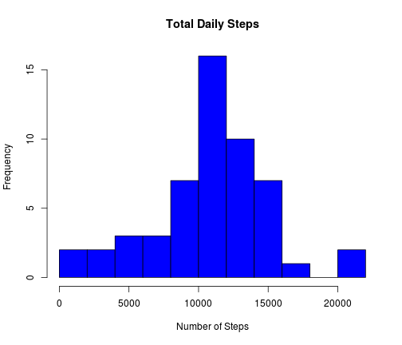
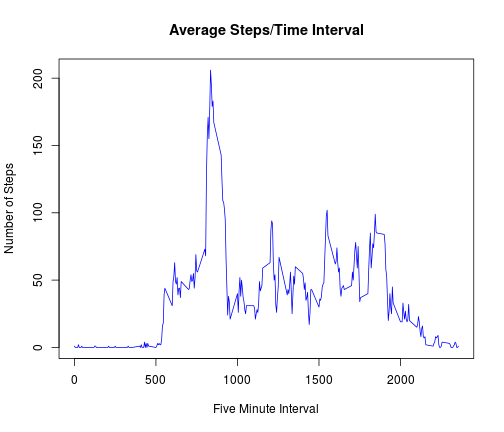
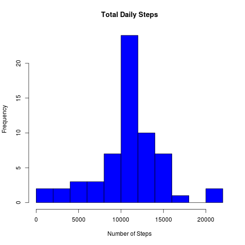
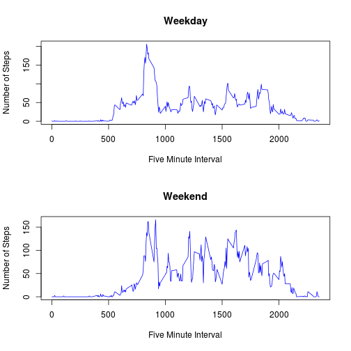

Samsung Sensor Activivty Data
========================================================

The first step after downloading the data is to load it into R. Here the data is loaded into a variable called activity and the sum of steps per day is calculated and stored in total.steps:


```r
activity<-read.csv('activity.csv');
total.steps<-aggregate.data.frame(activity$steps,FUN=sum,by=list(activity$date))
```

**Summary of Initial Data**

**Total Daily Steps**


```r
hist(total.steps$x,main='Total Daily Steps',xlab='Number of Steps',col="blue",breaks=10)
```

 

**Mean and Median of Total Steps**


```r
summary(total.steps$x)
```

```
##    Min. 1st Qu.  Median    Mean 3rd Qu.    Max.    NA's 
##      41    8840   10800   10800   13300   21200       8
```

**Steps by Five Minute Interval**


```r
library('sqldf')
avg.steps<-sqldf('select interval,avg(steps) as steps from activity group by interval')
plot(avg.steps$interval,avg.steps$steps,type='l',col="blue",main='Average Steps/Time Interval',
     xlab='Five Minute Interval',ylab='Number of Steps')
```

 

**The interval with the max average steps is 835.**

**The total number of rows missing values (NA) is 2304.**

**Replace NA's in activity data with average steps for that interval.**


```r
activity.no.na<-activity
for (i in 1:nrow(activity.no.na)){
     if (is.na(activity.no.na[i,1])){
         activity.no.na[i,1]<-avg.steps[which(avg.steps$interval==activity.no.na[i,3]),2]
     }
}
total.steps.na<-aggregate.data.frame(activity.no.na$steps,FUN=sum,by=list(activity.no.na$date))
hist(total.steps.na$x,main='Total Daily Steps',xlab='Number of Steps',col="blue",breaks=10)
```

 

```r
summary(total.steps.na$x)
```

```
##    Min. 1st Qu.  Median    Mean 3rd Qu.    Max. 
##      41    9820   10600   10700   12800   21200
```

Imputing missing values with the average steps on the interval of the missing value reduces the mean and median total steps.

**Add column for weekday/weekend**

```r
activity.no.na<-cbind(activity.no.na,sapply(activity.no.na$date,FUN=function(x)
    {ifelse(weekdays(as.Date(x))=='Saturday' || weekdays(as.Date(x))=='Sunday','weekend','weekday')}))
colnames(activity.no.na)[4]<-'weekday'
```

**Plot weekday and weekend average steps per interval.**

```r
avg.weekday<-sqldf('select interval,avg(steps) as steps from "activity.no.na" 
                   where weekday="weekday" group by interval')
avg.weekend<-sqldf('select interval,avg(steps) as steps from "activity.no.na" 
                   where weekday="weekend" group by interval')
par(mfrow=c(2,1))
plot(avg.weekday$interval,avg.weekday$steps,type='l',col="blue",main='Weekday',
     xlab='Five Minute Interval',ylab='Number of Steps')
plot(avg.weekend$interval,avg.weekend$steps,type='l',col="blue",main='Weekend',
     xlab='Five Minute Interval',ylab='Number of Steps')
```

 
